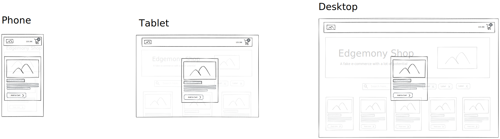
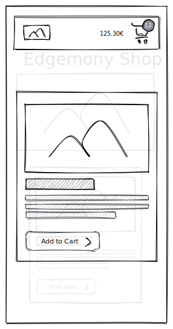

# Esercitazione 08-03-21

Aggiungere i prodotti al carrello.
Visualizzare il numero di prodotti e il prezzo totale del carrello nell'header.

## Istruzioni

Il carrello è una lista di prodotti salvata nello `state` del componente `App`.

Aggiungere nel modale del dettaglio prodotto un pulsante "Add to cart".
Quando il pulsante viene cliccato il prodotto viene aggiunto al carrello.
Se un prodotto è nel carrello il testo del pulsante diventa "In cart" e il pulsante non è cliccabile.

Nell'header deve essere visualizzato il numero di prodotti aggiunti al carrello e il prezzo totale.

---

> **Opzionale**: copiate il contenuto del file [handler.js](../src/mocks/handlers.js) nel vostro file `src/mocks/handlers.js`. Un `service worker` a quel punto intercetterà le vostre chiamate API e in modo casuale restituirà la risposta corretta oppure un errore. Non dovete modificare nulla nel modo in cui effettuate le chiamate.
> Quando fate le chiamate API per scaricare la lista dei prodotti (ed eventualmente la lista di categorie) dovete quindi controllare il codice dello `status` restituito nella risposta. Se il codice corrisponde ad un errore (`status >= 400`) la risposta deve essere gestita come un errore.
>
> https://developer.mozilla.org/en-US/docs/Web/API/Response/status
>
> https://developer.mozilla.org/it/docs/Web/HTTP/Status

> **Opzionale**: separare la logica delle chiamate API dalla logica del componente. Definire le funzioni che effettuano le chiamate nel file `src/services/api.js`, per poi importarle nel componente `App`.

---

## Consegna

Prima di iniziare ogni nuova esercitazione, assicurarsi di aver mergiato l'esercitazione precedente.

- create il branch `esercitazione-08-03-21`, partendo da `main`
- fate i vostri commit
- fate il push del branch: `git push --set-upstream origin esercitazione-08-03-21`
- spostatevi sul branch `main`
- mergiate il vostro branch: `git merge --no-ff esercitazione-08-03-21`
- fate il push di `main`
