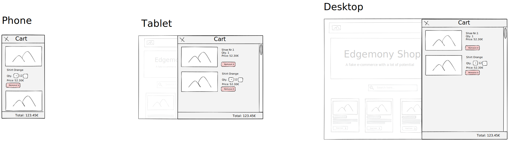
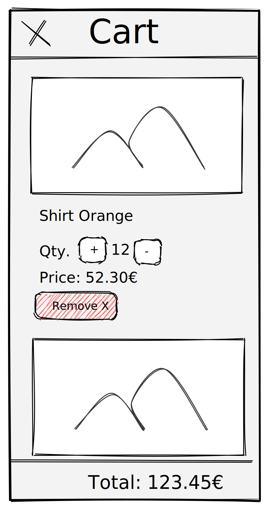

# Esercitazione 09-03-21

Creare una modale contenente i prodotti a carrello.

## Istruzioni

Al click sull'icona del carrello implementata nell'`<HeaderCart>` far aprire una modale.

La modale avrà le seguenti caratteristiche:

- Avrà un `<header>` fixed contenente il titolo **Cart** e un `<button>` che chiude la modale stessa.
- Avrà un `<footer>` fixed con indicato il totale del carrello.
- All'interno presenterà la lista dei prodotti attualmente presenti nel carrello mostrando:
  - L'immagine
  - Il nome
  - La quantità
  - Il prezzo
- Sui dispositivi a schermo largo sarà visibile un'overlay trasparente che impedirà l'interzione con la pagina sottostante
- Cliccando sull'overlay la modale si chiude
- La modale avrà una larghezza massima e sui dipositivi con display piccolo sarà visibile a pieno schermo.

---

> **Opzionale**: Aggiungere la possibilità di rimuovere i prodotti dal carrello.

> **Opzionale**: Implementare la possibilità di aggiungere più quantità dello stesso prodotto.

---

## Consegna

Prima di iniziare ogni nuova esercitazione, assicurarsi di aver mergiato l'esercitazione precedente.

- create il branch `esercitazione-09-03-21`, partendo da `main`
- fate i vostri commit
- fate il push del branch: `git push --set-upstream origin esercitazione-09-03-21`
- spostatevi sul branch `main`
- mergiate il vostro branch: `git merge --no-ff esercitazione-09-03-21`
- fate il push di `main`
