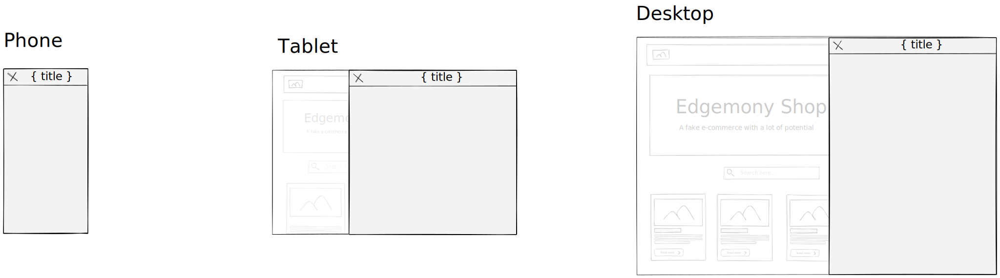

# Esercitazione 10-03-21

Creare un sidebar modal generico, che contenga al suo interno il carrello.

## Istruzioni

L'esercitazione di oggi è totalmente opzionale: 
se avete dubbi o cose da rivedere sulle esercitazioni dei giorni scorsi, usate il vostro tempo 
per completare e consolidare il lavoro svolto finora. Fate un refactor dove è il caso,
cercando di rendere il codice più leggibile e semplice da gestire. Cercate di comprendere
esattamente come funziona ogni linea di codice che avete scritto, per avere completamente sotto 
controllo il vostro progetto.

Solo per chi ha già svolto tutte le esercitazioni, e si sente sufficientemente sicuro sul lavoro svolto finora:

Creare una modal generica visualizzata come sidebar. 
Deve essere visualizzata esattamente come la modale che avete creato per l'esercitazione precedente.
L'unica cosa che deve contenere è l'header, in cui viene visualizzato il pulsante per chiudere la modale e il titolo.
Dovrà avere le seguenti props:
- `title`
- `onClose`
- `isOpen`
- `children`

Il contenuto della modale (escluso l'header, già presente) deve essere passato sotto forma di `children`. 

Potete creare un componente separato per il carrello, chiamato `Cart`.

Questa esercitazione è un refactor: non vengono modificate in alcun modo le funzionalità dell'app. 
Per l'utente l'app continua a comportarsi esattamente come prima.

---

## Consegna

Prima di iniziare ogni nuova esercitazione, assicurarsi di aver mergiato l'esercitazione precedente.

- create il branch `esercitazione-10-03-21`, partendo da `main`
- fate i vostri commit
- fate il push del branch: `git push --set-upstream origin esercitazione-10-03-21`
- spostatevi sul branch `main`
- mergiate il vostro branch: `git merge --no-ff esercitazione-10-03-21`
- fate il push di `main`
