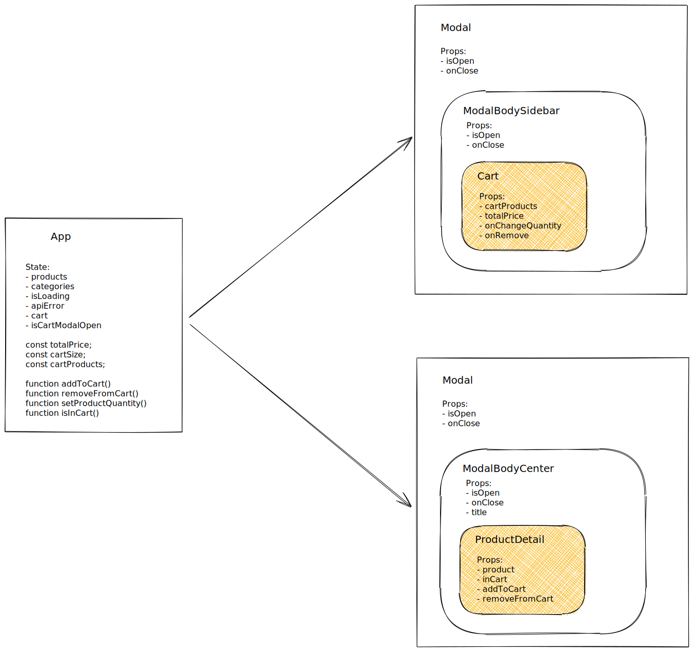

# Esercitazione 15-03-21

Creare un modal generico, che contenga al suo interno il dettaglio dei prodotti.


## Istruzioni

Creare un modal generico visualizzato al centro dello schermo.
Deve essere visualizzata esattamente come la modale che già esiste per il dettaglio del prodotto.
L'unica cosa che deve contenere è il pulsante per chiudere la modale.
Il componente `Modal` dovrà avere le seguenti props:

- `onClose`
- `isOpen`
- `children`

Creare un componente `ProductDetail` che visualizzi il dettaglio del prodotto.

Passare il componente `ProductDetail` come `children` al componente `Modal`.

Questa esercitazione è un refactor: non vengono modificate in alcun modo le funzionalità dell'app.
Per l'utente l'app continua a comportarsi esattamente come prima.


Esempio di utilizzo in `App.js`:

```jsx
<ModalSidebar
  title="Cart"
  isOpen="{isCartModalOpen}"
  close={closeCartModal}
>
  <Cart
    products="{cartProducts}"
    totalPrice="{cartTotal}"
    removeFromCart="{removeFromCart}"
    setProductQuantity="{setProductQuantity}"
  />
</ModalSidebar>

<Modal isOpen="{isProductModalOpen}" close="{closeProductModal}">
  {productInModal && (
  <ProductDetail
    product="{productInModal}"
    inCart="{isInCart(productInModal)}"
    addToCart="{addToCart}"
    removeFromCart="{removeFromCart}"
  />
  )}
</Modal>
```

---

## Esercizio opzionale (avanzato)

Dope aver eseguito l'esercizio base, creare una versione generica del modal, che permetta di visualizzare entrambi i modal.

Creare i seguenti componenti:

- `Modal`: contiene l'overlay; il body deve essere passato come `children`
- `ModalBodyCenter`: contiene il body del modal, visualizzato al centro dello schermo; il contenuto del modal viene passato come `children`
- `ModalBodySidebar`: contiene il body del modal, visualizzato come sidebar; il contenuto del modal viene passato come `children`



Esempio di utilizzo in `App.js`:

```jsx
<Modal isOpen="{isCartOpen}" onClose="{closeCart}">
  <ModalBodySidebar title="Cart" isOpen="{isCartOpen}" onClose="{closeCart}">
    <Cart
      products="{cartProducts}"
      totalPrice="{cartTotal}"
      removeFromCart="{removeFromCart}"
      setProductQuantity="{setProductQuantity}"
    />
  </ModalBodySidebar>
</Modal>

<Modal isOpen="{isProductDetailOpen}" onClose="{closeProductDetail}">
  <ModalBodyCenter
    isOpen="{isProductDetailOpen}"
    onClose="{closeProductDetail}"
  >
    {productInModal && (
    <ProductDetail
      product="{productInModal}"
      inCart="{isInCart(productInModal)}"
      addToCart="{addToCart}"
      removeFromCart="{removeFromCart}"
    />
    )}
  </ModalBodyCenter>
</Modal>
```

## Consegna

Prima di iniziare ogni nuova esercitazione, assicurarsi di aver mergiato l'esercitazione precedente.

- create il branch `esercitazione-15-03-21`, partendo da `main`
- fate i vostri commit
- fate il push del branch: `git push --set-upstream origin esercitazione-15-03-21`
- spostatevi sul branch `main`
- mergiate il vostro branch: `git merge --no-ff esercitazione-15-03-21`
- fate il push di `main`
