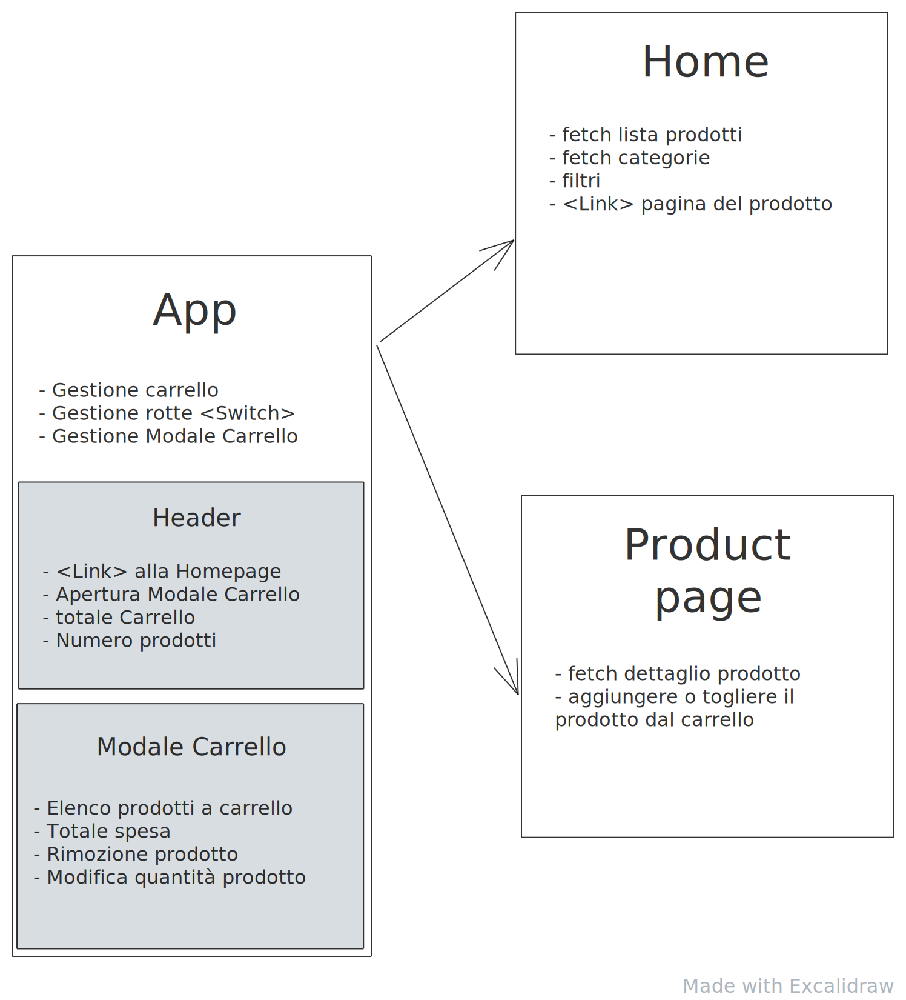
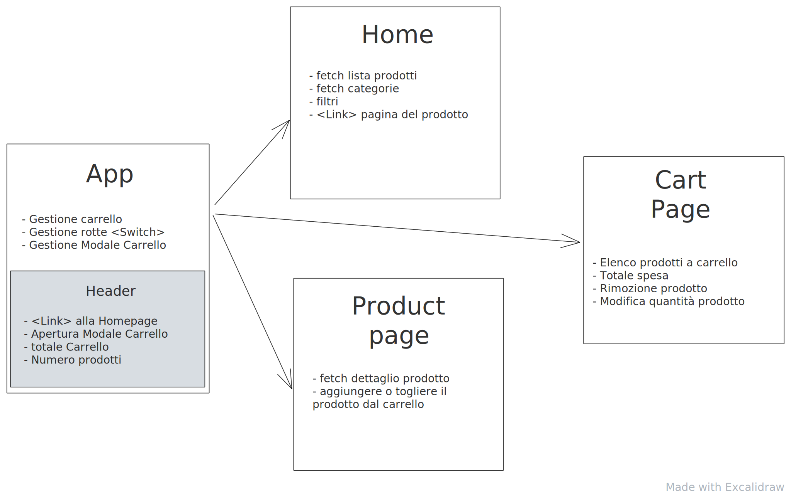

# Esercitazione 16-03-21

Ricreare, sul proprio repository, l'applicazione con `react-router-dom`.

## Istruzioni

Come nel codice implementato durante la lezione, ricreare l'applicazione, dividendola in 3 pagine:

- `Home`
- `Product`
- `Page404`

---

## Esercizio opzionale (avanzato)

Implementare anche la pagina `Cart`, rimuovendo la modale da `App`.

## Consegna

Prima di iniziare ogni nuova esercitazione, assicurarsi di aver mergiato l'esercitazione precedente.

- create il branch `esercitazione-16-03-21`, partendo da `main`
- fate i vostri commit
- fate il push del branch: `git push --set-upstream origin esercitazione-16-03-21`
- spostatevi sul branch `main`
- mergiate il vostro branch: `git merge --no-ff esercitazione-16-03-21`
- fate il push di `main`
