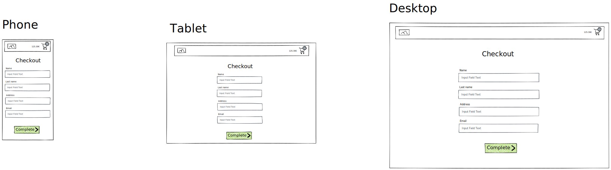
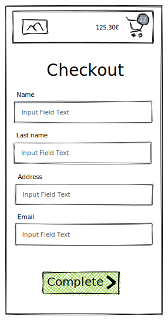
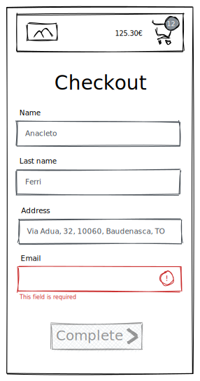

# Esercitazione 19-03-21

Aggiungere la pagina di checkout.

## Importante

Prima di iniziare l'esercitazione dovete aggiornare il contenuto del vostro file `handler`:
copiate il contenuto del [nostro file handler.js](../src/mocks/handlers.js) nel vostro file `src/mocks/handlers.js`

## Istruzioni

Se sono stati aggiunti prodotti nel carrello, nella pagina `/cart` dovrà essere visualizzato un link "Go to checkout", che dovrà indirizzare alla pagina `/checkout`.

Creare una nuova pagina all'url `/checkout`. La pagina dovrà contenere un form con i seguenti campi:

- name
- last name
- address
- email

Quando il form viene inviato devono essere eseguite le seguenti operazioni, in sequenza:

- aggiornare il carrello con i dati del form
- creare un ordine
- creare un nuovo carrello
- aggiornare lo stato dell'applicazione

### Aggiornare il carrello

Utilizzare l'endpoint `PATCH /carts/{id}`. Nel body va passato un oggetto con proprietà `billingData`, contenente i dati del form.
L'endpoint restituisce il carrello aggiornato.

### Creare un nuovo ordine

Creare un ordine a partire dal carrello, utilizzando l'endpoint `POST /orders`.
Nel body va passato l'oggetto `{cartId: [id]}` (per esempio: `{cartId: 1}`).
L'endpoint restituisce l'ordine creato.

### Creare un nuovo carrello

Utilizzare l'endpoint `POST /carts`. Non va passato nulla nel body.
L'endpoint restituisce il carrello creato.

### Aggiornare lo stato dell'applicazione

Aggiornare lo stato dell'applicazione con il nuovo carrello. Salvare nel localStorage (chiave "edgemony-cart-id") l'id del nuovo carrello creato.

## Eservizio opzionale 1

Aggiungere la validazione del form. I campi sono tutti obbligatori, il campo "email" deve anche contenere un'email valida.
Non deve essere possibile inviare un form non valido.

## Esercizio opzionale 2

Create una rotta `/order-completed/:orderId` in cui visualizzare il riepilogo dell'ordine: articoli acquistati, dati dell'utente, prezzo totale.
Dopo la creazione dell'ordine l'utente dovrà essere reindirizzato in automatico a questa pagina.

## Documentazione API

La documentazione delle API è fornita da un documento OpenApi: [openapi.yml](./docs/openapi.yml)

Potete visualizzare la preview della documentazione utilizzando un plugin per Visual Studio Code: https://marketplace.visualstudio.com/items?itemName=42Crunch.vscode-openapi

## Consegna

Prima di iniziare ogni nuova esercitazione, assicurarsi di aver mergiato l'esercitazione precedente.

- create il branch `esercitazione-19-03-21`, partendo da `main`
- fate i vostri commit
- fate il push del branch: `git push --set-upstream origin esercitazione-19-03-21`
- spostatevi sul branch `main`
- mergiate il vostro branch: `git merge --no-ff esercitazione-19-03-21`
- fate il push di `main`
